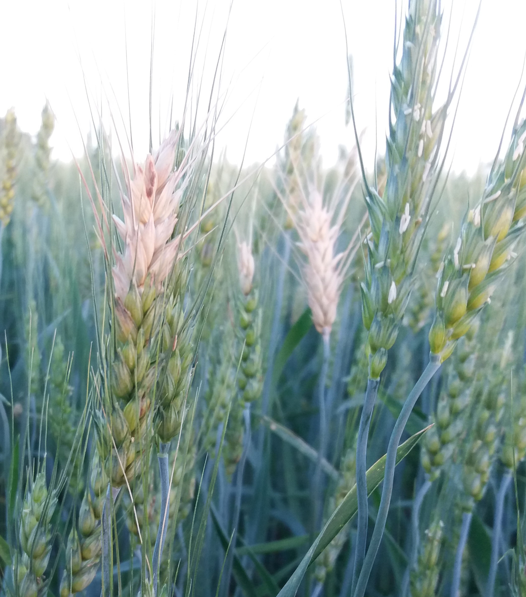

## About

This website provides easy access to commented R scripts that allows reproducing the analysis of the data from our publication.

This study provides an updated summary of the effects of different chemistry applied sequentially (three sprays starting at the heading stage) for managing wheat blast (caused by *Pyricularia oryzae Triticum* lineage). For such, we gathered data from 44 uniform field trials conducted during nine growing seasons (2012-2020) across several wheat-producing states in Brazil. Additionally, we evaluated whether the estimates of control efficacy and yield response varied over time, space, and on different levels of disease or yield; and calculated fungicide profitability based on the break-even probabilities.

 

Code: [MIT](https://opensource.org/licenses/MIT) year: 2021, copyright holder: Emerson Del Ponte

